# Restaurant Management System

This repository contains the implementation of a Restaurant Management System. The system is designed to handle various tasks such as managing customer information, table assignments, and order processing. It provides functionalities for both customers and staff to interact with the system.

## Table of Contents

- [Features](#features)
- [Use Case Diagram](#use-case-diagram)
- [User Stories](#user-stories)
- [Class Diagram](#class-diagram)
- [Object Diagram](#object-diagram)
- [Installation](#installation)
- [Usage](#usage)
- [Test Cases](#test-cases)
- [Screenshots](#screenshots)
- [Contributing](#contributing)
- [License](#license)

## Features

- Add, edit, and remove customers
- Assign tables to customers
- Add, edit, and cancel orders
- View menu items
- Manage reservations

## Use Case Diagram

The use case diagram illustrates the various interactions between customers and staff with the restaurant management system.

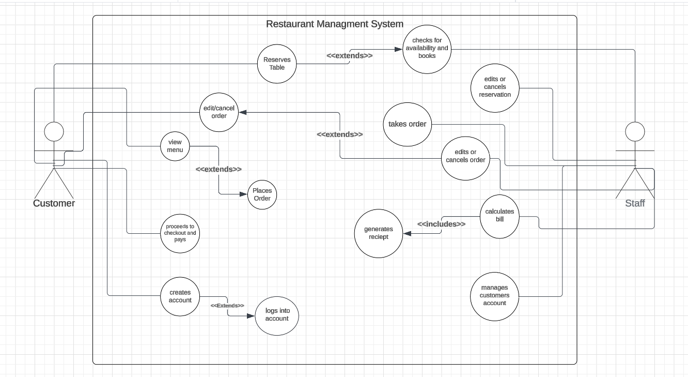

## User Stories

User stories help in understanding the functionalities required from the system in different scenarios.


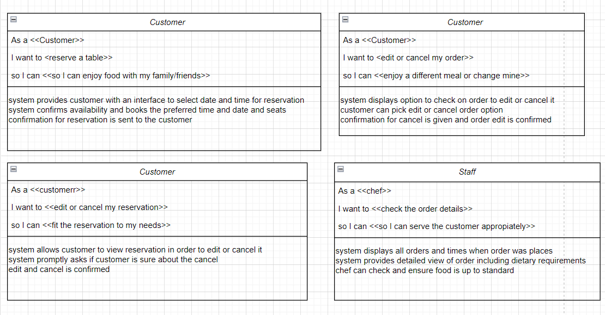

## Class Diagram

The class diagram shows the structure of the system, including classes, attributes, and relationships.

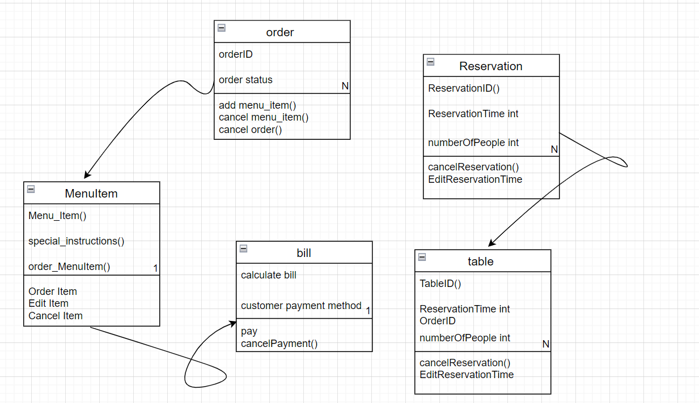

## Object Diagram

The object diagram provides specific instances of the classes and their relationships in the system.

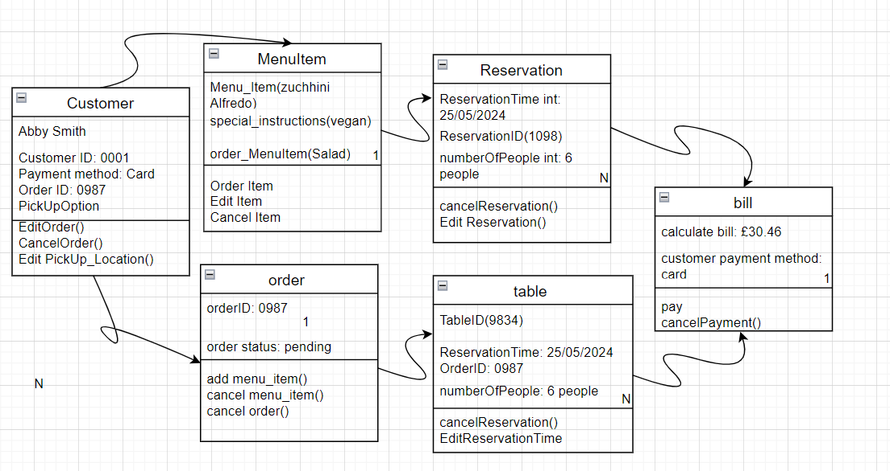

## Installation

1. Clone the repository:
   ```bash
   git clone https://github.com/imustitanveer/Restaurant-Management-System-In-Python.git
   ```
2. Navigate to the project directory:
   ```bash
   cd restaurant-management-system
   ```
3. Ensure you have Python installed. The project requires Python 3.6 or higher.

## Usage

Run the main script to start the restaurant management system:
```bash
python main.py
```

Follow the on-screen menu to add customers, assign tables, and manage orders.

## Test Cases

Below is the test case table used to validate the functionality of the restaurant management system:

| Test Case ID | Description                            | Input                        | Expected Output                            | Actual Output                              | Pass/Fail |
|--------------|----------------------------------------|------------------------------|--------------------------------------------|--------------------------------------------|-----------|
| TC1          | Add a valid customer                   | ID: 1, Name: John, Contact: x | Customer added successfully                | Customer added successfully                | Pass      |
| TC2          | Add a customer with missing ID         | ID: , Name: John, Contact: x  | Error message                              | Error message                              | Pass      |
| TC3          | Assign table to a customer             | Customer ID: 1, Table ID: 1  | Table assigned successfully                | Table assigned successfully                | Pass      |
| TC4          | Assign an already assigned table       | Customer ID: 1, Table ID: 1  | Error message                              | Error message                              | Pass      |
| TC5          | Add an order with valid items          | Order ID: 101, Customer ID: 1 | Order added successfully                   | Order added successfully                   | Pass      |
| TC6          | Add an order for non-existing customer | Order ID: 102, Customer ID: 2 | Error message                              | Error message                              | Pass      |
| TC7          | Cancel an order                        | Order ID: 101                | Order canceled successfully                | Order canceled successfully                | Pass      |
| TC8          | Cancel a non-existing order            | Order ID: 103                | Error message                              | Error message                              | Pass      |

## Screenshots

Screenshots of the application in action:

1. **Add Customer**
   
   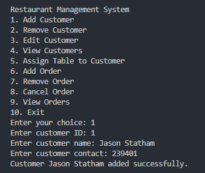

3. **Add Invalid Customer**
   
   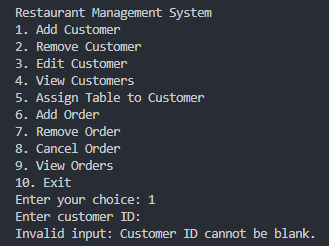

5. **Assign Table**
   
   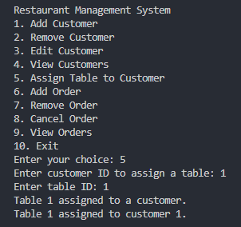

7. **Assign already Assigned Table**
   
   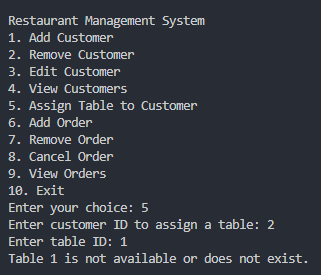

9. **Add Order**
    
   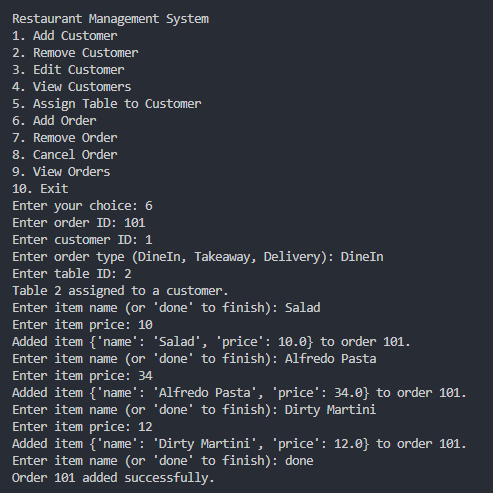

11. **Add Invalid Order**
    
   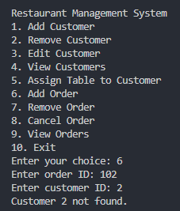

13. **Cancel Order**
    
   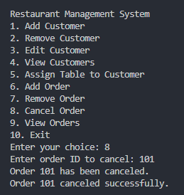

15. **Cancel Non-Existent Order**
    
   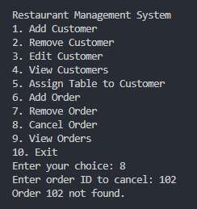

## Contributing

Contributions are welcome! Please read the [contributing guidelines](CONTRIBUTING.md) before making any changes.
